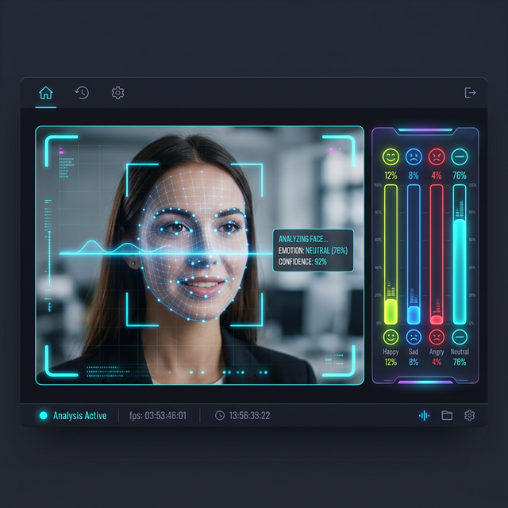

# 🎭 Face Emotion Recognition: Premium Edition



## 🚀 Overview
**Face Emotion Recognition (FER)** is a high-performance, real-time desktop application designed to analyze human emotions through a webcam feed with exceptional accuracy and speed. Leveraging the power of **DeepFace** and **OpenCV**, this tool provides instant emotional feedback, augmented with meaningful quotes and real-time intensity metrics.

Whether you're exploring AI-driven sentiment analysis or building a foundation for human-computer interaction (HCI), this project represents a "best-in-class" implementation of computer vision technolgies.

## ✨ Key Features
- **Real-time Detection**: Seamless emotion analysis from your webcam with zero-lag performance (optimized via multi-threading).
- **Deep Analytics**: Goes beyond just "one emotion" – tracks intensity across multiple emotional states (Happy, Sad, Angry, etc.).
- **Smart Feedback**: Dynamically serves insightful quotes based on your current emotional state to improve user engagement.
- **Premium UI**: A sleek, dark-themed dashboard built with an optimized Python GUI framework.
- **Privacy First**: All processing happens locally on your machine – no data is uploaded to the cloud.

## 🛠️ Tech Stack
| Component | Technology |
|---|---|
| AI Engine | DeepFace (VGG-Face, Emotion model) |
| Vision Framework | OpenCV (Haar Cascades for face detection) |
| GUI | Tkinter (Custom themed) |
| Image Processing | Pillow (PIL) |
| Language | Python 3.11+ |

## 📦 Installation & Setup

### 1. Requirements
Ensure you have Python 3.11+ installed on your **Windows** machine.

### 2. Install Dependencies
```powershell
pip install opencv-python deepface Pillow
```

### 3. Run the Application
```powershell
python main.py
```

## 📸 Visual Gallery
### Live Analysis Interface
The dashboard provides real-time visualization of emotional intensity:


### Real-Time Capture
Snapshots allow you to save key emotional moments:

*Figure: Live detection identifying an 'Angry' state.*

## 🧠 Emotional Intelligence Map
| Emotion | Example Feedback Quote |
|---|---|
| **Happy** | "Happiness is a choice. Choose it every day!" |
| **Sad** | "Every cloud has a silver lining. Keep your head up." |
| **Angry** | "Stay calm and keep moving forward. Perspective is key." |
| **Neutral** | "Sometimes, no emotion is the best emotion for focus." |
| **Surprise** | "Life is full of surprises. Embrace the unexpected!" |
| **Fear** | "Fear is temporary; regret is forever. Be brave." |

## 🚀 Future Roadmap
- [ ] **Emotion Timeline**: Track and graph your mood throughout the day.
- [ ] **Snapshot Gallery**: Capture and save your high-emotion moments automatically.
- [ ] **Custom Themes**: Nebula, Cyberpunk, and Minimalist UI themes.
- [ ] **Advice Engine**: Providing actionable productivity or wellness advice based on detected stress levels.

---
*Created with ❤️ by the Antigravity AI Assistant.*
[id:Face-Emotion-Recognition-v2.0]
